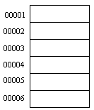
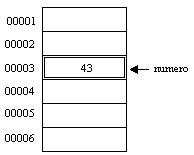
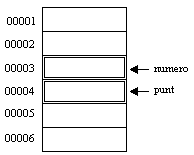
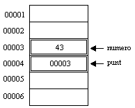

[[capítulo-8.-introducción-a-las-funciones]]
== [[anchor]]Capítulo 8. Introducción a las funciones

[[introducción]]
=== [[anchor-1]]Introducción

Vamos a dar un paso más en la complejidad de nuestros programas.
Vamos a empezar a usar funciones creadas por nosotros.
Las funciones son de una gran utilidad en los programas.
Nos ayudan a que sean más legibles y más cortos.
Con ellos estructuramos mejor los programas.

Una función sirve para realizar tareas concretas y simplificar el programa.
Nos sirve para evitar tener que escribir el mismo código varias veces.

Los bucles que hemos estudiado son útiles cuando hay que repetir una parte del código varias veces.
Las funciones son útiles cuando tenemos que repetir el mismo código en diferentes partes del programa.

Ya hemos visto en el curso algunas funciones como printf y scanf.
Algunas de éstas están definidas en una biblioteca (la biblioteca estándar de C) que el compilador carga automáticamente en cada programa.

Sin embargo nosotros también podemos definir nuestras propias funciones.
Pocas veces se ve un programa un poco complejo que no use funciones.
Una de ellas, que usamos siempre, es la función main.

[[definición-de-una-función]]
=== [[anchor-2]]Definición de una función

Una función tiene el siguiente formato:

[source,c]
----
tipo_de_dato nombre_de_la_función( argumentos )
{
 definición de variables;

 cuerpo de la función;

 return valor;
}
----

A continuación vamos a ver en detalle cada una de las partes de una función:

[[el-nombre-de-la-función]]
==== El nombre de la función

El nombre de la función se usa para llamarla dentro del programa.
Nombres de funciones que ya conocemos serían _printf_ o _scanf_.

El nombre de una función debe cumplir los siguientes requisitos:

* Sólo puede contener letras, números y el símbolo '_'.
* No se pueden usar tildes ni espacios.
* El nombre de una función debe empezar por una letra, nunca por un número.
* No podemos usar _palabras reservadas_. Las palabras reservadas son
aquellas que se usan en C, por ejemplo _if_, _for_, _while_. Un
nombre de función puede contener una palabra reservada: por ejemplo
_while_ no se puede usar como nombre de función, pero _while_1_ sí.

[[tipo-de-dato]]
==== Tipo de dato

Cuando una función se ejecuta y termina puede devolver un valor.
Este valor puede ser cualquiera de los tipos de variables que hemos visto en el capítulo de Tipos de datos (int, char, float, double).
También puede ser un tipo de dato definido por nosotros (esto lo veremos más tarde).
El valor que devuelve la función suele ser el resultado de las operaciones que se realizan en la función, o si han tenido éxito o no.

El valor devuelto debe ser del tipo indicado en _tipo_de_dato_.

También podemos usar el tipo *void*.
Este nos permite indicar que la función no devuelve ningún valor.
Cuando este sea el caso la palabra reservada _return_ se utiliza sola, sin ningún valor a continuación de ésta.
O también podemos emitir poner _return_.

En este ejemplo usamos una (absurda) función que devuelve un número entero:

[source,c]
----
#include <stdio.h>
#include <stdlib.h>

int dame_un_diez()
{
  return 10;
}

int main()
{
  printf( "%d\n", dame_un_diez() );

  return EXIT_SUCCESS;
}
----

El tipo de dato que devuelve es _int_ y lo devuelve a través del _return_.

[[definición-de-variables]]
==== Definición de variables

Dentro de la función podemos definir variables que sólo tendrán validez dentro de la propia función.
Si declaramos una variable en una función no podemos usarla en otra.
A estas variables que solo existen dentro de una función las llamamos *_variables locales_*.

Ver “link:#anchor-3[Vida de una variable ]” para más información sobre el tema.

Otro (absurdo) ejemplo de una función que usa una _variable local_:

[source,c]
----
#include <stdio.h>
#include <stdlib.h>

int dame_un_diez()
{
  int diez = 10;

  return diez;
}

int main()
{
  printf( "%d\n", dame_un_diez() );

  return EXIT_SUCCESS;
}
----

En este ejemplo la variable _diez_ no está accesible desde _main_.

[[cuerpo-de-la-función]]
==== Cuerpo de la función

Aquí es donde va el código de la función.

[[argumentos-o-parámetros]]
==== Argumentos o parámetros

Antes hemos visto que una variable definida en una función no se puede
usar dentro de otra. Entonces ¿cómo le pasamos valores a una función
para que trabaje con ellos? Para esto es para lo que se usan los
argumentos.

Estos son variables que se pasan como datos a una función. Una función
puede tener un argumento, muchos o ninguno. Cuando tiene más de uno
éstos deben ir separados por una coma. Cada variable debe ir con su tipo
de variable.

Un ejemplo de una función con parámetros sería:

[source,c]
----
#include <stdio.h>
#include <stdlib.h>

int suma(int numero1, int numero2)
{
  return numero1 + numero2;
}

int main()
{
  printf( "%d\n", suma(10, 5) );

  return EXIT_SUCCESS;
}
----

[[dónde-se-definen-las-funciones]]
=== [[anchor-4]]Dónde se definen las funciones

Las funciones deben definirse siempre antes de donde se usan.
Lo habitual en un programa es:

[cols="",]
|=======================================================================
|*Sección * |*Descripción *

|Includes |Aquí se indican qué ficheros externos se usan.

|Definiciones de constantes |Aquí se definen las constantes que se usan
en el programa.

|Definición de variables |Aquí se definen las variables globales (las
que se pueden usar en TODAS las funciones).

|Prototipos de funciones |Aquí es donde se definen las cabeceras de las
funciones.

|Definición de las funciones |Aquí se “desarrollan” las funciones.
Pueden colocarse en cualquier orden. Por costumbre, yo suelo poner main
en primer lugar.
|=======================================================================

Esta es una forma muy habitual de estructurar un programa. Sin embargo
esto no es algo rígido, no tiene por qué hacerse así, pero es
recomendable.

Los prototipos de las funciones consisten en definir solo las cabeceras
de las funciones, sin escribir su código. Esto nos permite luego poner
las funciones en cualquier orden. El estándar ANSI C dice que no son
obligatorios los prototipos de las funciones pero es recomendable
usarlos.

Ejemplos:

#include <stdio.h>

int compara( int a, int b ); /* Definimos la cabecera de la función */

int main()

\{

 int num1, num2;

 int resultado;

 printf( "Introduzca dos numeros: " );

 scanf( "%d %d", &num1, &num2 );

 resultado = compara( num1, num2 );

 printf( "El mayor de los dos es %d\n", resultado );

 return 0;

}

int compara( int a, int b ) /* Ahora podemos poner el cuerpo de la
función donde queramos. Incluso después de donde la llamamos (main) */

\{

 int mayor;

 if ( a>b )

 mayor = a;

 else

 mayor = b;

 return mayor;

}

________________________________________________________________________________________________________________________________________________________________________________________________________________________________
*NOTA:* Por simplicidad este ejemplo no tiene en cuenta el caso de que
los números sean iguales. Se deja al alumno como ejercicio modificar el
programa para que tenga en cuenta la posibilidad de que los números sean
iguales.
________________________________________________________________________________________________________________________________________________________________________________________________________________________________

Cuando se define la cabecera de la función sin su cuerpo (o código)
debemos poner un ';' al final. Cuando definamos el cuerpo más tarde no
debemos poner el ';', se hace como una función normal.

La definición debe ser igual cuando definimos sólo la cabecera y cuando
definimos el cuerpo. Mismo nombre, mismo número y tipo de parámetros y
mismo tipo de valor devuelto.

Las funciones deben definirse antes de ser llamadas. En los ejemplos a
continuación se llama a la función desde main, así que tenemos que
definirlas antes que main. Lo habitual es definir primero la “cabecera”
o prototipos de la función, que no es más que la definición de la
función si su “cuerpo” y desarrollar después la función completa.

**Ejemplo 1**. Función sin argumentos que no devuelve nada:

Este programa llama a la función prepara pantalla que borra la pantalla
y muestra el mensaje "la pantalla está limpia". Por supuesto es de nula
utilidad pero nos sirve para empezar.

#include <stdio.h>

void mostrar_mensaje(); /* Prototipo de la función */

int main()

\{

printf( "Esta es la función main\n" );

 prepara_pantalla();/* Llamamos a la función */

 return 0;

}

/* Desarrollo de la función */

void mostrar_mensaje() /* No se debe poner punto y coma aquí */

\{

 printf( "Esta es la funcion mostrar_mensaje\n" );

 return; /* No hace falta devolver ningún valor,

 este return no es necesario */

}

*Ejemplo 2.* Función con argumentos, no devuelve ningún valor:

En este ejemplo la función _compara_ toma dos números, los compara y nos
dice cual es mayor.

#include <stdio.h>

void compara( int a, int b );

int main()

\{

 int num1, num2;

 printf( "Introduzca dos numeros: " );

 fflush(stdout);

 scanf( "%d %d", &num1, &num2 );

 /* Llamamos a la función con sus dos argumentos */

 compara( num1, num2 );

 return 0;

}

void compara( int a, int b ) /* Pasamos los parámetros a y b a la
función */

\{

 if ( a>b )

 printf( "%d es mayor que %d\n" , a, b );

 else if ( a<b )

 printf( "%d es mayor que %d\n", b, a );

 else +
 printf("%d es igual que %d\n", a, b);

}

**Ejemplo 3**. Función con argumentos que devuelve un valor.

Este ejemplo es como el anterior pero devuelve como resultado el mayor
de los dos números.

#include <stdio.h>

int compara( int a, int b );

int main()

 \{

 int num1, num2;

 int resultado;

 printf( "Introduzca dos numeros: " );

 fflush(stdout);

 scanf( "%d %d", &num1, &num2 );

 /* Recogemos el valor que devuelve la función en la variable
*resultado* */

 resultado = compara( num1, num2 );

 printf( "El mayor de los dos es %d\n", resultado );

 return 0;

 }

/* Metemos los parámetros a y b a la función */

int compara( int a, int b )

\{

 /* Esta función define su propia variable,

 esta variable sólo se puede usar aquí */

 int mayor;

 if ( a>b )

 mayor = a;

 else

 mayor = b;

 return mayor;

}

En este ejemplo podíamos haber hecho también:

 printf( "El mayor de los dos es %i\n", compara( num1, num2 ) );

De esta forma nos ahorramos tener que definir la variable 'resultado'.

[[vida-de-una-variable]]
=== [[anchor-5]][[anchor-3]][[anchor-5]]Vida de una variable

Cuando definimos una variable dentro de una función, esa variable sólo
es válida dentro de la función. Este tipo de variables se denominan
**variables locales**. Si definimos una variable dentro de main sólo
podremos usarla dentro de main, será por tanto una variable local de la
función main.

Si por el contrario la definimos fuera de las funciones se trataría de
una *variable global* y se podría usar en cualquier función.

Podemos crear una variable global y en una función una variable local
con el mismo nombre. Dentro de la función estaremos trabajando con la
variable local, no con la global. Esto no da errores pero puede crear
confusión al programar y al analizar el código. No es nada recomendable
seguir esta práctica.

Por norma general *es aconsejable usar siempre variables locales* frente
a las globales ya que será más sencilla la localización de errores y
ayuda a la reutilización de código (podemos copiar/pegar las funciones a
otro programa). Por sencillez, en muchos ejemplos usaremos variables
globales, pero el alumno debería acostumbrarse a usar variables locales.

[[ejercicios]]
=== [[anchor-6]]Ejercicios

*Ejercicio 1:* Descubre los errores:

#include <stdio.h>

int main()

\{

 int num1, num2;

 int resultado,

 printf( "Introduzca dos números: " );

 fflush(stdout);

 scanf( "%d %d", &num1, &num2 );

 resultado = compara( num1, num2 );

 printf( "El mayor de los dos es %d\n", resultado );

 return 0;

}

int compara( int a, int b );

\{

 int mayor;

 if ( a>b )mayor = a;

 else mayor = b;

 return mayor;

}

**Solución**:

* Hay una coma después de _int_ _resultado_ en vez de un punto y coma.
* Llamamos a la función _compara_ dentro de main antes de definirla. Si
hubiésemos puesto el prototipo de la función al principio del código no
hubiera sido problema.
* Cuando definimos la función _compara_ hemos puesto un punto y coma al
final, eso es un error. El código que hay justo detrás no pertenece a
ninguna función.

*Ejercicio 2:* Busca los errores.

#include <stdio.h>

int resultado( int parametro )

int main()

\{

 int a, b;

 a = 2; b = 3;

 printf( "%i", resultado( a );

 return 0;

}

char resultado( int parametro )

\{

 return parametro + b;

}

Solución:

* Hemos definido el prototipo de _resultado_ sin punto y coma.
* Cuando definimos el cuerpo de _resultado_ en su cabecera hemos puesto
__char__, que no coincide con el prototipo.
* En la función _resultado_ estamos usando la variable 'b' que está
definida sólo en main. No es una variable global y por lo tanto es como
si no existiera para __resultado__.
* En printf nos hemos dejado un paréntesis al final.

== Capítulo 9. Punteros

[[introducción]]
=== [[anchor]]Introducción

Este capítulo puede resultar problemático a aquellos que no han visto nunca lo que es un puntero.
Por lo tanto si tienes alguna duda o te parece que alguna parte está poco clara ponte en contacto conmigo.

¡¡¡Punteros!!! uff.
Este es uno de los temas que más suele costar a la gente al aprender C.
Los punteros son una de las más potentes características de C, pero a la vez uno de sus mayores peligros.
Si no se manejan con cuidado pueden ser una fuente ilimitada de errores.
Un error usando un puntero puede bloquear el sistema y a veces puede ser difícil detectarlo.

Otros lenguajes no nos dejan usar punteros para evitar estos problemas, pero a la vez nos quitan parte del control que tenemos en C.

A pesar de todo esto no hay que tenerles miedo.
Casi todos los programas C usan punteros.
Si aprendemos a usarlos bien no tendremos más que algún problema esporádico. Así que atención, valor y al toro.

[[la-memoria-del-ordenador]]
=== [[anchor-1]]La memoria del ordenador

Si tienes bien claro lo que es la memoria del ordenador puedes saltarte esta sección.
Pero si confundes la memoria con el disco duro o no tienes claro lo que es no te la pierdas.

A lo largo de mi experiencia con ordenadores me he encontrado con mucha gente que no tiene claro cómo funciona un ordenador.
Cuando hablamos de memoria nos estamos refiriendo a la memoria RAM del ordenador.
Son unas _pastillas_ que se conectan a la placa base y nada tienen que ver con el disco duro.
El disco duro guarda los datos permanentemente (hasta que se rompe) y la información se almacena como ficheros.
Nosotros podemos decirle al ordenador cuándo grabar, borrar, abrir un documento, etc.
La memoria RAM en cambio, se borra al apagar el ordenador.
La memoria RAM la usan los programas sin que el usuario de éstos se de cuenta.

Hay otras memorias en el ordenador aparte de la mencionada.
Por ejemplo la memoria de vídeo (que está en la tarjeta gráfica), las memorias caché (del procesador, de la placa...).

[[direcciones-de-variables]]
=== [[anchor-2]]Direcciones de variables

Vamos a ir como siempre por partes.
Primero vamos a ver qué pasa cuando declaramos una variable.

Al declarar una variable estamos diciendo al ordenador que nos reserve una parte de la memoria para almacenarla.
Cada vez que ejecutemos el programa la variable se almacenará en un sitio diferente.
Eso no lo podemos controlar, depende de la memoria disponible y otros factores "misteriosos".
Puede que se almacene en el mismo sitio, pero es mejor no fiarse.

Dependiendo del tipo de variable que declaremos el ordenador nos reservará más o menos memoria.
Como vimos en el capítulo de tipos de datos cada tipo de variable ocupa más o menos bytes.
Por ejemplo si declaramos un _char_, el ordenador nos reserva 1 byte (usualmente 8 bits).
Una variable de tipo _int_ ocupará más espacio (depende del compilador y el sistema en el que trabajemos).

Cuando finaliza el programa todo el espacio reservado para las variables queda libre para ser usado por otros programas.

NOTE: Si bien usualmente un carácter (char) esta constituido por ocho bits esto no lo garantiza el estándar.
El numero exacto esta dado por la macro CHAR_BIT).

Saber cuánto ocupa un carácter en tu sistema es imporante.
Para saberlo puedes usar este sencillo programa:

[source,c]
----
#include <stdio.h>
#include <limits.h>
#include <stdlib.h>

int main()
{
  printf("Bits que ocupa un carácter: %d", CHAR_BIT);

  return EXIT_SUCCESS;
}
----

Existe una forma de saber qué direcciones nos ha reservado el ordenador para nuestras variables.
Se trata de usar el operador *&* (operador de dirección).
Ya lo habíamos visto en el _scanf_ pero no sabíamos bien para qué era.
Vamos a ver un ejemplo: Declaramos la variable 'a' y obtenemos su valor y dirección.

[source,c]
----
#include <stdio.h>
#include <stdlib.h>

int main()
{
  char a;

  a = 10;

  printf( "La variable 'a' se almacena en la posición de memoria %p ", (void *) &a );
  printf( "y su valor es %d\n.", a );

  return EXIT_SUCCESS;
}
----

NOTE: Para mostrar la dirección de la variable usamos %p (en lugar de %d).
Éste _modificador de formato_ sirve para escribir direcciones de memoria.
El formato que se usa para mostrar las direcciones de memoria es el hexadecimal.

El resultado sería algo como:

----
La variable a se almacena en la posición de memoria 0x7fff13be7627 y su valor es 10.
----

Si ejecutamos el programa varias veces seguidas veremos algo curioso:

* El valor de _a_ siempre es el mismo.
* Pero la posición de la memoria donde se almacena la variable cambia cada vez.

La segunda vez pude mostrar algo como ésto:

----
La variable a se almacena en la posición de memoria 0x7fff8e74c037 y su valor es 10.
----

Y la tercera:

----
La variable a se almacena en la posición de memoria 0x7ffc79a200a7 y su valor es 10.
----

Como podemos ver, cada vez que ejecutamos el programa la dirección de la memoria donde se almacena _a_ es diferente.
Pero una vez el sistema nos ha reservado esa dirección ya no cambia durante la ejecución del programa.

El valor de _a_ lo podemos controlar nosotros.
El valor de la memoria que nos asigna el sistema podemos conocerlo pero no controlarlo.

Es importante tener clara la diferencia entre el valor de _a_ y el valor de la memoria donde se almacena _a_.

El nombre de la variable es equivalente a poner un nombre a una zona de la memoria.
Cuando en el programa escribimos 'a', en realidad estamos diciendo, "el valor que está almacenado en la dirección de memoria a la que llamamos 'a'".

[[qué-son-los-punteros]]
=== [[anchor-3]]Qué son los punteros

Ahora ya estamos en condiciones de ver lo que es un puntero.
Un puntero es una variable un tanto especial.
Con un puntero podemos almacenar direcciones de memoria.
En un puntero podemos tener guardada la dirección de una variable.

Vamos a ver si captamos bien el concepto de puntero y la diferencia entre éstos y las variables _normales_.

En el dibujo anterior tenemos una representación de lo que sería la memoria del ordenador.
Cada casilla representa un byte de la memoria.
Y cada número es su dirección de memoria.
La primera casilla es la posición 00001 de la memoria.
La segunda casilla la posición 00002 y así sucesivamente.

Supongamos que ahora declaramos una variable _char_:

[source,c]
----
char numero = 43.
----

El ordenador nos guardaría por ejemplo la posición 00003 para esta variable.
Esta posición de la memoria queda reservada y ya no la puede usar nadie más.
Además esta posición a partir de ahora se le llama _numero_.
Como le hemos dado el valor 43 a _numero_, el valor 43 se almacena en numero, es decir, en la posición 00003.

Veamos cómo hubiera sido el resultado del programa anterior con esta
situación:

[source,c]
----
#include <stdio.h>
#include <stdlib.h>

int main()
{
  char numero;

  numero = 43;

  printf( "La variable numero " );
  printf( "se almacena en la posición de memoria %p,", (void *) &numero );
  printf( "y su valor es %d\n", numero );

  return EXIT_SUCCESS;
}

----

El resultado sería:

----
La variable numero se almacena en la posición de memoria *00003*, y su
valor es *43*
----

Creo que así ya está clara la diferencia entre el valor de una variable (43) y su dirección (00003).

Ahora vamos un poco más allá, vamos a declarar un puntero.
Hemos dicho que un puntero sirve para almacenar la direcciones de memoria.
Muchas veces los punteros se usan para guardar las direcciones de variables.
Vimos en el capítulo Tipos de Datos que cada tipo de variable ocupa un espacio distinto en la memoria.
Por eso cuando declaramos un puntero debemos especificar el tipo de datos cuya dirección almacenará.
En nuestro ejemplo queremos que almacene la dirección de una variable char.
Así que para declarar el puntero *punt* debemos hacer:

[source,c]
----
char *punt;
----

El * (asterisco) sirve para indicar que se trata de un puntero, debe ir
antes del nombre de la variable.

*NOTA:* El lenguaje C es un lenguaje de "formato libre" y la declaración
de la variable "punt" podría realizarse en cualquiera de estas formas,
todas ellas validas:

[source,c]
----
char*punt; +
char* punt; +
char * punt; +
char *punt; +
char +
* +
punt;
----

En la variable punt sólo se pueden guardar direcciones de memoria, no se
pueden guardar datos. Vamos a volver sobre el ejemplo anterior un poco
ampliado para ver cómo funciona un puntero:

#include <stdio.h>
#include <stdlib.h>

int main()

\{

 char numero;

 char *punt;

 numero = 43;

 punt = &numbero;

 printf( "La variable numero se almacena en la posición de memoria %p, y
su valor es %d\n", (void *) &numero, numero );

 return EXIT_SUCCESS;

}

Vamos a ir línea a línea:

* En el primer _int numero_ reservamos memoria para _numero_ (supongamos
que queda como antes, posición 00003). Por ahora _numero_ no tiene
ningún valor.
* Siguiente línea: _int *punt;_. Reservamos una posición de memoria para
almacenar el puntero, por ejemplo en la posición 00004. Por ahora _punt_
no tiene ningún valor, es decir, no apunta a ninguna variable. Esto es
lo que tenemos por ahora:

* Tercera línea: _numero = 43;_.
Aquí ya estamos dando el valor 43 a _numero_.
Se almacena 43 en la dirección 00003, que es la de _numero_.
* Cuarta línea: _punt = \&numero;_.
Por fin damos un valor a punt.
El valor que le damos es la dirección de numero (ya hemos visto que _&_ devuelve la dirección de una variable).
Así que _punt_ tendrá como valor la dirección de numero, 00003.
Por lo tanto ya tenemos:

Cuando un puntero tiene la dirección de una variable se dice que ese
puntero *apunta* a esa variable.

_*NOTA:*_ La declaración de un puntero depende del tipo de dato al que
queramos apuntar. En general la declaración es:

tipo_de_dato *nombre_del_puntero;

Si en vez de querer apuntar a una variable tipo _char_ como en el
ejemplo hubiese sido de tipo _int_:

int *punt;

[[para-qué-sirve-un-puntero-y-cómo-se-usa]]
=== [[anchor-4]]Para qué sirve un puntero y cómo se usa

Los punteros tienen muchas utilidades, por ejemplo nos permiten pasar
variables a una función y modificarlos. También permiten el manejo de
cadenas de texto de arrays, de ficheros y de listas enlazadas (ya
veremos todo esto más adelante). Otro uso es que nos permiten acceder
directamente a la pantalla, al teclado y a todos los componentes del
ordenador (sólo en determinados sistemas operativos).

Pero si sólo sirvieran para almacenar direcciones de memoria no
servirían para mucho. Nos deben dejar también la posibilidad de acceder
a esas posiciones de memoria. Para acceder a ellas se usa el operador *,
que no hay que confundir con el de la multiplicación.

#include <stdio.h>
#include <stdlib.h>

int main()

\{

 char numero;

 char *punt;

 numero = 43;

 punt = &numero;

 printf( "La variable numero se almacena en la posición de memoria %p, y
su valor es %d.\n",

 (void *) &numero, **punt* );

 return EXIT_SUCCESS;

}

Si nos fijamos en lo que ha cambiado con respecto al ejemplo anterior,
vemos que para acceder al valor de número usamos *punt en vez de numero.
Esto es así porque punt apunta a numero y *punt nos permite acceder al
valor al que apunta punt.

#include <stdio.h>
#include <stdlib.h>

int main()

\{

 char numero;

 char *punt;

 numero = 43;

 punt = &numero;

 **punt = 30;*

 printf( "La variable numero se almacena en la posición de memoria %p, y
su valor es %d.\n", (void *) &numero, numero );

 return EXIT_SUCCESS;

}

Ahora hemos cambiado el valor de numero a través de _*punt_.

En resumen, usando _punt_ podemos apuntar a una variable y con _*punt_
vemos o cambiamos el contenido de esa variable.

Un puntero no sólo sirve para apuntar a una variable, también sirve para
apuntar una dirección de memoria determinada. Esto tiene muchas
aplicaciones, por ejemplo nos permite controlar el hardware directamente
(en MS-Dos y Windows, no en Linux). Podemos escribir directamente sobre
la memoria de vídeo y así escribir directamente en la pantalla sin usar
printf.

[[usando-punteros-en-una-comparación]]
=== [[anchor-5]]Usando punteros en una comparación

Veamos el siguiente ejemplo. Queremos comprobar si dos variables son
iguales usando punteros:

#include <stdio.h>
#include <stdlib.h>

int main()

\{

 int a, b;

 int *punt1, *punt2;

 a = 5; b = 5;

 punt1 = &a; punt2 = &b;

 if ( punt1 == punt2 )

 printf( "Son iguales.\n" );

 return EXIT_SUCCESS;

}

Alguien podría pensar que el _if_ se cumple y se mostraría el mensaje
_Son iguales_ en pantalla. Pues no es así, el programa es erróneo. Es
cierto que a y b son iguales. También es cierto que punt1 apunta a 'a' y
punt2 a 'b'. Lo que queríamos comprobar era si a y b son iguales. Sin
embargo con la condición estamos comprobando si punt1 apunta al mismo
sitio que punt2, estamos comparando las direcciones donde apuntan. Por
supuesto a y b están en distinto sitio en la memoria así que la
condición es falsa. Para que el programa funcionara deberíamos usar los
asteriscos:

#include <stdio.h>
#include <stdlib.h>

int main()

\{

 int a, b;

 int *punt1, *punt2;

 a = 5; b = 5;

 punt1 = &a; punt2 = &b;

 if ( **punt1 == *punt2* )

 printf( "Son iguales.\n" );

 return EXIT_SUCCESS;

}

Ahora sí. Estamos comparando el contenido de las variables a las que
apuntan punt1 y punt2. Debemos tener mucho cuidado con esto porque es un
error que se nos puede escapar con mucha facilidad.

Vamos a cambiar un poco el ejemplo. Ahora 'b' no existe y punt1 y punt2
apuntan a 'a'. La condición se cumplirá porque apuntan al mismo sitio.

#include <stdio.h>
#include <stdlib.h>

int main()

\{

 int a;

 int *punt1, *punt2;

 a = 5;

 *punt1 = &a; punt2 = &a;*

 if ( punt1 == punt2 )

 printf( "punt1 y punt2 apuntan al mismo sitio.\n" );

 return EXIT_SUCCESS;

}

[[punteros-como-argumentos-de-funciones]]
=== [[anchor-6]]Punteros como argumentos de funciones

Hemos visto en el capítulo de funciones cómo pasar parámetros y cómo
obtener resultados de las funciones (con los valores devueltos con
return). Pero tiene un inconveniente, sólo podemos tener un valor
devuelto. Ahora vamos a ver cómo los punteros nos permiten modificar
varias variables en una función.

Hasta ahora para pasar una variable a una función hacíamos lo siguiente:

#include <stdio.h>
#include <stdlib.h>

int suma( int a, int b )

\{

 return a+b;

}

int main()

\{

 int var1, var2, resultado;

 var1 = 5; var2 = 8;

 resultado = suma(var1, var2);

 printf( "La suma es : %i\n", resultado );

 return EXIT_SUCCESS;

}

Aquí hemos pasado a la función los parámetros 'a' y 'b' (que no podemos
modificar) y nos devuelve la suma de ambos.

Vamos a modificar el ejemplo para que use punteros:

#include <stdio.h>
#include <stdlib.h>

void suma( int a, int b, int *total )

\{

 *total = a + b;

}

int main()

\{

 int var1, var2, resultado;

 var1 = 5; var2 = 8;

 suma(var1, var2, &resultado);

 printf( "La suma es: %d.\n", resultado );

 return EXIT_SUCCESS;

}

Como podemos ver la función ya no devuelve un valor, pero le hemos
añadido un tercer parámetro _int *total_. Este parámetro es un puntero
que va a recibir la dirección donde se almacena _resultado_
(_&resultado_) y va a guardar ahí el resultado de la suma. Cuando
finalice la función y volvamos a la función _main_ la variable
_resultado_ se encontrará con que tiene como valor la suma de los dos
números.

Supongamos ahora que queremos tener la suma pero además queremos que
_var1_ se haga cero dentro de la función. Para eso haríamos lo
siguiente:

#include <stdio.h>
#include <stdlib.h>

int suma_y_cambia( *int *a*, int b )

\{

 int c;

 c = *a + b;

 *a = 0;

 return c;

}

int main()

\{

 int var1, var2, resultado;

 var1 = 5; var2 = 8;

 resultado = suma_y_cambia(*&var1*, var2);

 printf( "La suma es: %d y var1 vale: %d.\n", resultado , var1 );

 return EXIT_SUCCESS;

}

Fijémonos en lo que ha cambiado (con letra en negrita): En la función
suma hemos declarado 'a' como puntero. En la llamada a la función
(dentro de main) hemos puesto & para pasar la dirección de la variable
var1. Ya sólo queda hacer cero a var1 a través de *a=0.

También usamos una variable 'c' que nos servirá para almacenar la suma
de 'a' y 'b'.

Es importante no olvidar el operador & en la llamada a la función ya que
sin el no estaríamos pasando la dirección de la variable sino el valor
de _var1_.

Podemos usar tantos punteros como queramos en la definición de la
función.

*NOTA IMPORTANTE*: Existe la posibilidad de hacer el ejercicio de esta
otra manera, sin usar la variable _resultado_:

#include <stdio.h>
#include <stdlib.h>

int suma( *int *a*, int b )

\{

 int c;

 c = *a + b;

 *a = 0;

 return c;

}

int main()

\{

 int var1, var2;

 var1 = 5; var2 = 8;

 printf( "La suma es: %d y var1 vale: %d\n", suma(*&var1*, var2) , var1
);

 return EXIT_SUCCESS;

}

Sin embargo, esto puede dar problemas, ya que no podemos asegurar de
cómo va a evaluar el compilador los argumentos de printf. Es posible que
primero almacene el valor de var1 antes de evaluar _suma_. Si ocurriese
así el resultado del programa sería: _La suma es 13 y a vale 5_, en
lugar de La suma es 13 y a vale 0.

[[ejercicios]]
=== [[anchor-7]]Ejercicios

_*Ejercicio 1:*_ Encuentra un fallo muy grave:

#include <stdio.h>
#include <stdlib.h>

int main()

\{

 int *a;

 *a = 5;

 return EXIT_SUCCESS;

}

*Solución*: No hemos dado ninguna dirección al puntero. No sabemos a
dónde apunta. Puede apuntar a cualquier sitio, al darle un valor estamos
escribiendo en un lugar desconocido de la memoria. Esto puede dar
problemas e incluso bloquear el ordenador. Recordemos que al ejecutar un
programa éste se copia en la memoria, al escribir en cualquier parte
puede que estemos cambiando el programa (en la memoria, no en el disco
duro).

_*Ejercicio 2:*_ Escribe un programa que asigne un valor a una variable
de tipo _int_. Hacer un puntero que apunte a ella y sumarle 3 usando el
puntero. Luego mostrar el resultado.

*Solución*: Esta es una posible solución:

#include <stdio.h>
#include <stdlib.h>

int main()

\{

 int a;

 int *b;

 a = 5;

 b = &a;

 *b += 3;

 printf( "El valor de a es = %d.\n", a );

 return EXIT_SUCCESS;

}

También se podía haber hecho:

printf( "El valor de a es = %d\n", *b );

